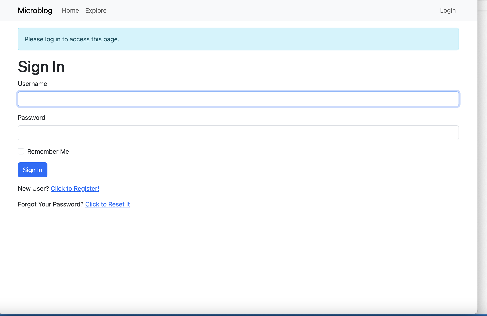
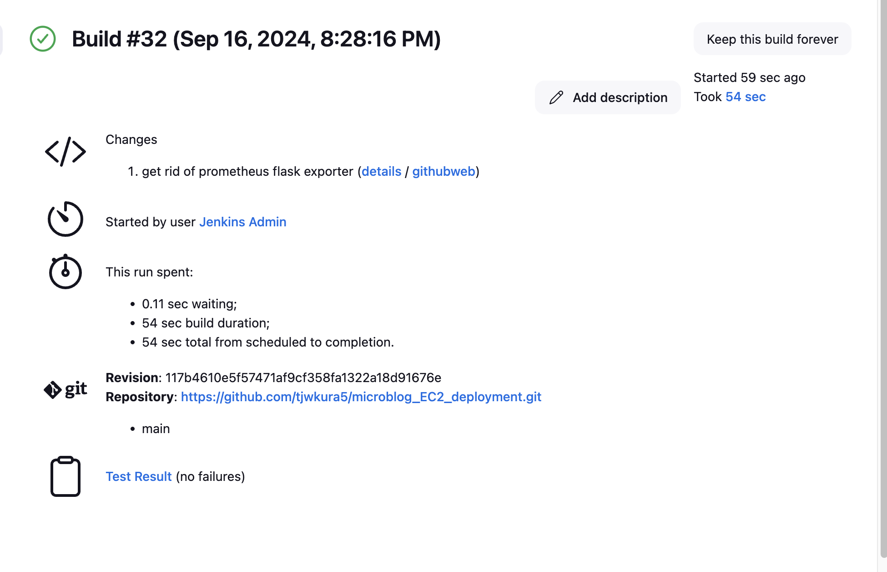
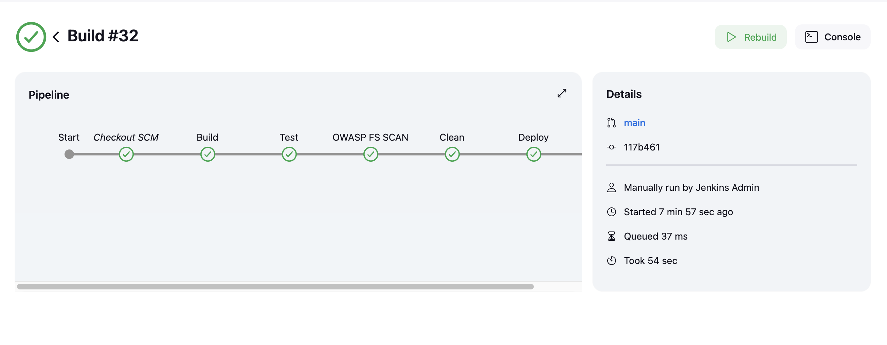
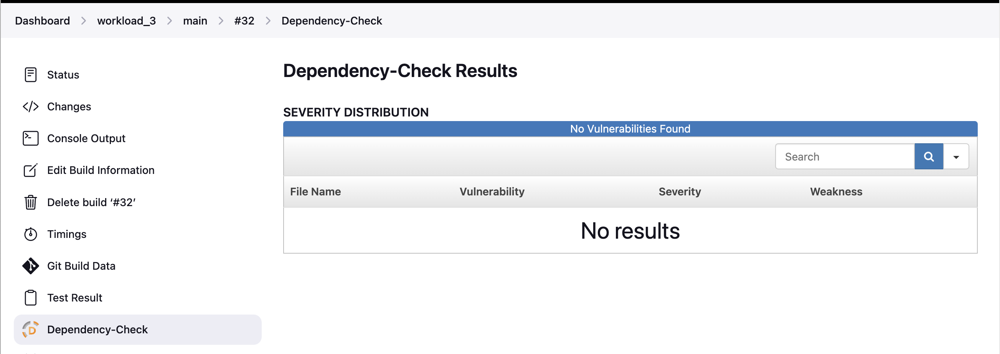
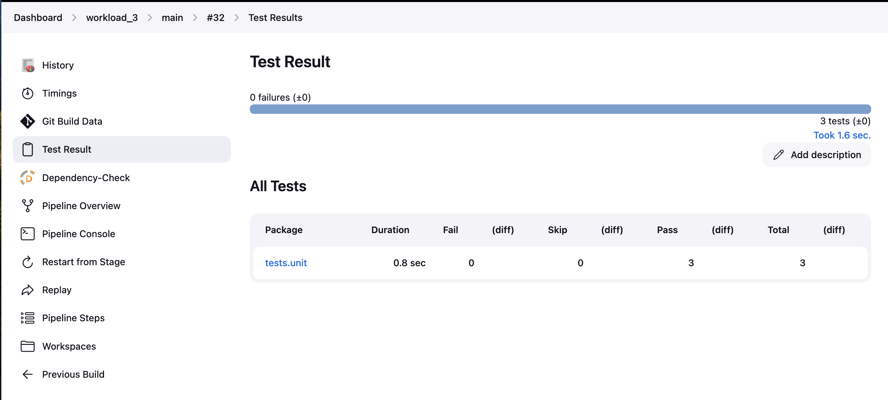
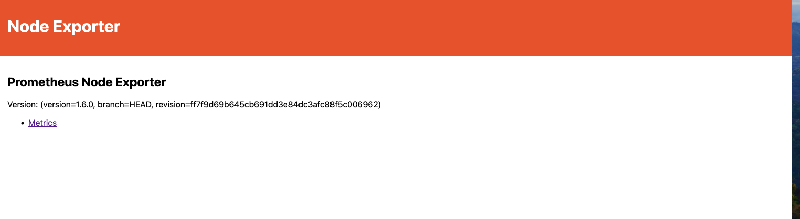
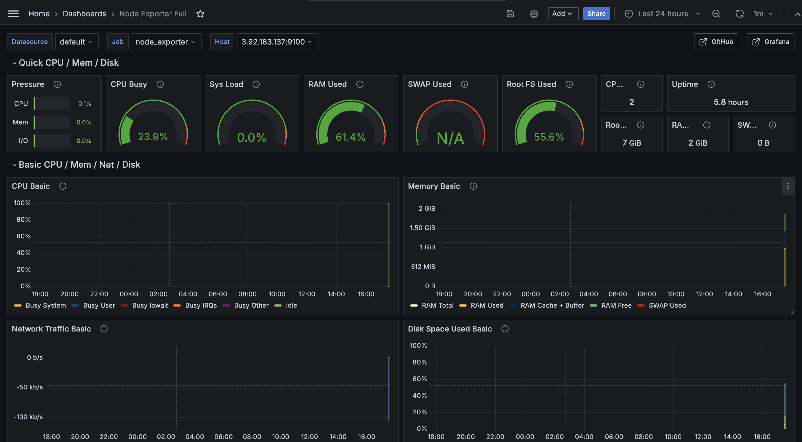
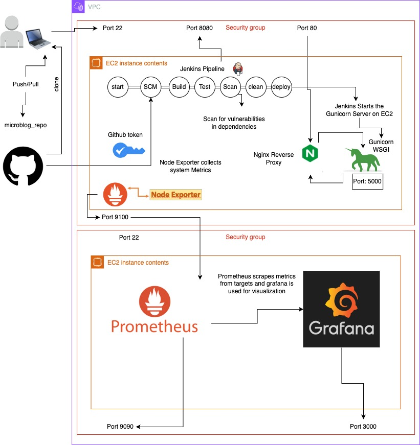

# Microblog Deployed to EC2 Instance


## Purpose

In our past two projects, we utilized AWS Managed Services, specifically Elastic Beanstalk, to provision the infrastructure for our applications. Elastic Beanstalk comes with many features out of the box, such as EC2 instances, monitoring and logging, security groups, and preconfigured platforms like Node.js and, in our case, Python. The purpose of this workload is to introduce provisioning our own infrastructure and deploying an application.

Let's get started!!

## Clone Repository

Clone [this](https://github.com/kura-labs-org/C5-Deployment-Workload-3) github repository to your Github account. The steps for this have been outlined in the past two workloads. If you get stuck you can refer back to workload 2 [here](https://github.com/tjwkura5/retail-banking-app-deployed-elastic-beanstalk-2).

## Jenkins and Application Server

**Setting Up the CI Server (Jenkins):**

Create an Ubuntu EC2 instance (t3.micro) named "Jenkins". Be sure to configure the security group to allow for SSH and HTTP traffic in addition to the ports required for Jenkins and any other services needed (Security Groups can always be modified afterward). We have gone over this step in the past two workloads so it should be familar if you need a refresher you can take a look at the instructions [here](https://github.com/kura-labs-org/AWS-EC2-Quick-Start-Guide/blob/main/AWS%20EC2%20Quick%20Start%20Guide.pdf).

We are going to be doing something different this time for installing jenkins. Instead of installing jenkins manually we will be creating a script to do this for us.

1. The first thing we want to do in our script is check if jenkins is already installed. We can use the dkpg command to list out all of the installed packages on our system and then pipe this over to our grep command to search for the word "jenkins" in the list. The -q flag makes grep run in quiet mode. 

    ```
    if dpkg -l | grep -q jenkins; then
    ```
2. If Jenkins is installed we want to check if jenkins is running.

    ```
    if systemctl is-active --quiet jenkins; then
    ```
    * **systemctl is-active jenkins:** Checks if the Jenkins service is running.

    * **--quiet:** Suppresses output. It only returns the exit status (0 if active, non-zero otherwise).
3. If Jenkins is running we can print an output message letting the user know. Otherwise, we will want to start Jenkins if it's not running.

    ```
    else
        echo "Jenkins is not running."
        echo "Starting jenkins.."
        sudo systemctl start jenkins
        sudo systemctl status jenkins
    fi
    ```
If jenkins is not installed in the first place we will need to install it:

5. Update System and Install Dependencies

    ```
    sudo apt update && sudo apt install fontconfig openjdk-17-jre software-properties-common -y
    ```
    * **apt update:** Updates the list of available packages.
    * **apt install fontconfig openjdk-17-jre software-properties-common:** Installs necessary dependencies for Jenkins (e.g., Java).
6. Add a repository to install Python 3.9.
Install Python 3.9 and its venv module for virtual environments
    ```
    sudo add-apt-repository ppa:deadsnakes/ppa -y
    sudo apt install python3.9 python3.9-venv -y
    ```
7. Download the Jenkins GPG key, required to verify the authenticity of the Jenkins package.

    ```
    sudo wget -O /usr/share/keyrings/jenkins-keyring.asc https://pkg.jenkins.io/debian-stable/jenkins.io-2023.key
    ```
8. Add Jenkins to the Package List

    ```
    echo "deb [signed-by=/usr/share/keyrings/jenkins-keyring.asc]" https://pkg.jenkins.io/debian-stable binary/ | sudo tee /etc/apt/sources.list.d/jenkins.list > /dev/null
    ```
9. Install jenkins

    ```
    sudo apt-get update
    sudo apt-get install jenkins -y
    ```
10. Start the Jenkins service and print its status to the console.

    ```
    sudo systemctl start jenkins
    sudo systemctl status jenkins
    ```

If everything looks good then we should be able to move on. If you like to see the final script (jenkins_install.sh) it is located in the root directory of the project. 

**Configure Application Server:**

We should already have python and venv installed from running the jenkins_install script but lets make sure we have the correct verions set. 

1. Run the following command to check the version.

    ```
    python3 --version
    ```
2. If Python 3.9 is not the default version you need to update the alternatives system: 

    ```
    sudo update-alternatives --install /usr/bin/python3 python3 /usr/bin/python3.9 2
    ```
3. Then, configure the default Python version:

    ```
    sudo update-alternatives --config python3
    ```
4. Check the Python version to ensure it's now set to Python 3.9:

    ```
    python3 --version
    ```
5. Once Python 3.9 is installed, you might need to install pip for Python 3.9:

    ```
    sudo apt install python3.9-distutils
    wget https://bootstrap.pypa.io/get-pip.py
    python3.9 get-pip.py
    ```
6. You can check that you have the correct version of pip by running the following:

    ```
    pip3 --version
    ```
Now that we have 'python3.9', 'python3.9-venv' and 'python3-pip' installed let's install and configure Nginx. If you recall from the last workload Nginx is a web server and reverse proxy server. We will need to run Nginx to forward client requests to our backend gunicorn server. Our gunicorn server is our application server that actually processes the request. 

1. Update the Package List: Before installing, update your package list to ensure you get the latest version of Nginx:

    ```
    sudo apt update
    ```
2. Install Nginx with the following command:

    ```
    sudo apt install nginx -y
    ```
3. Edit the NginX configuration file at "/etc/nginx/sites-enabled/default" so that "location" reads as below.

    ```
    location / {
    proxy_pass http://127.0.0.1:5000;
    proxy_set_header Host $host;
    proxy_set_header X-Forwarded-For $proxy_add_x_forwarded_for;
    }
    ```

The Nginx configuration file defines the default behavior of the Nginx web server, such as which directory to serve static files from, how to handle HTTP requests, and how to forward requests to other services like gunicorn. In the preceding block of code we are setting up a reverse proxy. Nginx will accept incoming HTTP requests and forward them to another server—in this case, our Flask app running on http://127.0.0.1:5000 (localhost on port 5000). The Flask app will process the request and send the response back to Nginx, which in turn sends it back to the client.

4. Start Nginx:

    ```
    sudo systemctl start nginx
    ```
5. To ensure Nginx starts automatically when the server is rebooted, enable the service:

    ```
    sudo systemctl enable nginx
    ```
6. You can check if Nginx is running with:

    ```
    sudo systemctl status nginx
    ```

**Write Our Unit test:**

1. Create a python script called test_app.py to run a unit test of the application source code. IMPORTANT: Put the script in a directory called "tests/unit/" of the GitHub repository.

2. Set up our imports:

    ```
    import pytest
    from microblog import app
    from app import db
    from app.models import User
    ```

* **import pytest:** Imports the pytest testing framework, which is used to create and run unit tests.
* **from microblog import app:** Imports the Flask app object from the microblog module.
* **from app import db:** Imports the db object, which is the SQLAlchemy instance used for database interactions.
* **from app.models import User:** Imports the User model from the app.models module, representing users in our app.

3. Setup Test Client Fixture. The client fixture creates a test client for sending HTTP requests to the Flask application.

    ```
    @pytest.fixture
    def client():
    app.config['SQLALCHEMY_DATABASE_URI'] = 'sqlite:///:memory:'
    app.config['TESTING'] = True
    with app.test_client() as client:
        with app.app_context():
            db.create_all()  # Create tables for the database
            yield client      # Provide the test client to the tests
            db.session.rollback()  # Clean up after the test
            db.drop_all()          # Drop all tables after test completes
    ```

* **SQLite In-Memory Database:** Configures the app to use an in-memory SQLite database for isolated testing.
* **Testing Mode:** Enables the TESTING mode in Flask, which provides better error handling.
* **Database Setup:** Creates and drops the database schema before and after each test to ensure a clean environment.

4. Let's Write our first test!

    ```
    def test_redirect(client):
        response = client.get('/', follow_redirects=True)
        assert response.status_code == 200
        assert b'<title>Sign In - Microblog</title>' in response.data
    ```
* **GET Request:** Sends a GET request to the root URL (/) of the app.
* **Follow Redirects:** Ensures that any redirects are followed.
* **Assertions:** Verifies that the status code is 200 and the HTML response contains the expected page title (Sign In).

This should be good for now. If you take a look at the test_app.py module in the project, you’ll notice I have an additional test with some helper methods. In the test client fixture, we are setting up an in-memory database using SQLite. This allows us to write tests that involve adding and retrieving records from a database, similar to how our application would behave in production.

Using an in-memory database removes the dependency on an actual database instance. Since in-memory databases like SQLite are created and run entirely in memory, they are much faster. Additionally, tests are isolated because each test run gets a fresh, empty database. This ensures that tests don’t interfere with one another.

For more details, feel free to explore the test_app.py module. Otherwise, go through the following step to run the test we created together:

1. Clone your GH repository to the server, cd into the directory, create and activate a python virtual environment with:

    ```
    $python3.9 -m venv venv
    $source venv/bin/activate
    ```
2. While in the python virtual environment, install the application dependencies and other packages by running:

    ```
    $pip install -r requirements.txt
    $pip install gunicorn pymysql cryptography
    ```
3. Run the following commands:
    ```
    $flask translate compile
    $flask db upgrade
    ```

4. Set the Pythonpath environment variable 
    ```
    export PYTHONPATH=$(pwd)
    ```

    The export PYTHONPATH=$(pwd) command is necessary to ensure that Python can find our project's modules when running scripts or tests from the command line.

5. From the root directory of the project run the test.
    ```
    pytest -s tests/unit/test_app.py
    ```

    We are incorporating the -s flag because it allows pytest to output to the console anything that your tests print, such as print() statements, which is useful for debugging. Normally, pytest captures and suppresses output, but the -s flag disables that, allowing you to see all printed output while running tests.

## Create Multibranch Pipeline

**Write Our Jenkins PipelineScript:**

The first step in creating our jenkins pipeline is creating our jenkins pipeline script. We can see that some of the work is already done for us but we will be responsible for filling out the build and deploy stages. 

**The build Stage**

The build stage should include all of the commands required to prepare the environment for the application. This includes creating the virtual environment and installing all the dependencies, setting variables, and setting up the databases. In order to do this we will need the following:

```
sh '''#!/bin/bash
python3.9 -m venv venv
source venv/bin/activate
pip install pip --upgrade
pip install -r requirements.txt
pip install gunicorn pymysql cryptography 
export FLASK_APP=microblog.py
flask translate compile
flask db upgrade
'''
```
Most of these commands should be familiar from the previous workloads but there are some differences.

* **pip install gunicorn pymysql cryptography:** Installs additional packages not listed in requirements.txt.

* **export FLASK_APP=microblog.py:**
    * **export:** Sets an environment variable for the current shell session.
    * **FLASK_APP=microblog.py:** Specifies the entry point for the Flask application. This tells Flask to use microblog.py as the main application file.
* **flask translate compile:** If our Flask app supports multiple languages and you have translation files (like .po files) that need to be turned into a format Flask can use (like .mo files), this command does that job. It "compiles" the translation files so your app can display text in different languages correctly.

* **flask db upgrade**: If there are changes to how our app stores data (like adding new tables or fields), this command applies those changes to the actual database. It makes sure the database is up-to-date with the latest structure and ready to use.

**The Test Stage**

The test stage in our pipeline script can stay the same for the most part. We do need to activate our virtual environment and create an environment variable for the python path before running our test. Our test stage will end up looking like this:

```
sh '''#!/bin/bash
source venv/bin/activate
export PYTHONPATH=$(pwd)
py.test ./tests/unit/ --verbose --junit-xml test-reports/results.xml
'''
```

**The OWASP FS SCAN Stage**

The OWASP Dependency-Check plugin is used for identifying known vulnerabilities in the libraries and dependencies that your software project uses. It looks at the libraries and frameworks your project uses and compares them against a database of known vulnerabilities (e.g., from the National Vulnerability Database (NVD)). If any of the dependencies have known vulnerabilities, it alerts you so you can address them.

**Benefits**

* **Improved Security:** Helps you identify and address security vulnerabilities in your project’s dependencies before they can be exploited.

* **Proactive Risk Management:** Enables you to manage risks by staying informed about the security status of your dependencies.

* **Compliance:** Helps ensure compliance with security standards and best practices by integrating vulnerability checks into your development workflow.

1. Access the Jenkins web interface. We have done this a few times now but if you need a refresher you can refer back to workload 1 [here](https://github.com/tjwkura5/retail-banking-app-deployed-elastic-beanstalk).
2. In Jenkins, install the "OWASP Dependency-Check" plug-in

    a. Navigate to "Manage Jenkins" > "Plugins" > "Available plugins" > Search and install

    b. Then configure it by navigating to "Manage Jenkins" > "Tools" > "Add Dependency-Check > Name: "DP-Check" > check "install automatically" > Add Installer: "Install from github.com"

3. Vist the National Vulnerability Database [website](https://nvd.nist.gov/developers/request-an-api-key) and sign up for an API key. This will save you a lot of time later on. The NVD public API, has very strict rate limits for anonymous users. As a result, it will take a long time to get updates. Sigining up for an API key is quick and free and it will make this stage much faster.

4. Add your API key to the jenkins pipeline script.

    ```
    dependencyCheck additionalArguments: '--scan ./ --disableYarnAudit --disableNodeAudit --nvdApiKey <API_KEY>', odcInstallation: 'DP-Check'
    dependencyCheckPublisher pattern: '**/dependency-check-report.xml'
    ```

**The Clean Stage**

So for this stage we just want a script to find and stop a running gunicorn process. This script should first locate the process ID using pgrep, checks if a valid PID is found, save the PID to a file, and then terminate the process. If no gunicorn process is found, just print a corresponding message.

```
sh '''#!/bin/bash
# Find the process ID of gunicorn using pgrep
pid=$(pgrep -f "gunicorn")

# Check if PID is found and is valid (non-empty)
if [[ -n "$pid" && "$pid" -gt 0 ]]; then
    echo "$pid" > pid.txt
    kill $(cat pid.txt)
    echo "Killed gunicorn process with PID $pid"
else
    echo "No gunicorn process found to kill"
fi
'''
```

**The Deploy Stage**

This stage is the trickiest, as we need to run the commands required to deploy the application so that it is accessible on the internet. The following command starts the Gunicorn WSGI server to serve your Flask application:

```
gunicorn -b :5000 -w 4 microblog:app
```

* **gunicorn:** This is the command to start the Gunicorn (Green Unicorn) WSGI server.

* **-b :5000:** This flag specifies the bind address and port. So, the app will be accessible via http://<server-ip>:5000.

* **-w 4:** This flag sets the number of worker processes. In this case, Gunicorn will spawn 4 worker processes to handle requests. More workers can help handle concurrent requests more efficiently.

* **microblog:app:** This tells Gunicorn which Flask application to serve. It specifies the Python module microblog (the file where your Flask app is defined), and app is the Flask instance in that module. 

If we run this command as-is in our Jenkins file, we will notice that while the application starts, the pipeline never finishes. If we manually cancel the pipeline, the application stops running. We need a way to ensure that the Gunicorn process continues running even after the deploy stage is complete. A good solution is to create a systemd service for our microblog application. systemd is a process manager for Linux operating systems that manages the starting, stopping, and restarting of system services (daemons) via service units. It can control background processes such as web servers—in our case, Gunicorn.

1. Create a Service Unit File:

    ```
    sudo nano /etc/systemd/system/gunicorn.service
    ```
2. Define the unit file configuration. The workingDirectory will be the path to your applications root directory. The ExecStart is the path to your bin directory within your virtual environment that you created and the ExecStart is the command used to start your app. Your configuration file should look something like the following:

    ```
    [Unit]
    Description=Gunicorn instance to serve microblog
    After=network.target

    [Service]
    User=jenkins
    Group=jenkins
    WorkingDirectory=/path/to/your/app
    Environment="PATH=/path/to/your/venv/bin"
    ExecStart=/path/to/your/venv/bin/gunicorn -b :5000 -w 4 microblog:app

    [Install]
    WantedBy=multi-user.target
    ```
3. After creating or modifying the unit file, reload the systemd manager configuration so it recognizes the new service:

    ```
    sudo systemctl daemon-reload
    ```
4. To enable the service so that it starts automatically on boot, use the following command:

    ```
    sudo systemctl enable gunicorn.service
    ```

5. Start the Service: Start the service using systemctl:

    ```
    sudo systemctl start gunicorn.service
    ```
6. Put the servers public IP address into the browsers address bar to view the App!

    

Ok so in the preceding step we got to see that our application was running but there is still some additional steps that we need to take to get this to work in jenkins. Right now if the jenkins user tries to execute sudo commands the user will be prompted for a password. To avoid this, we need to add entries for each of the commands we plan to run in the sudoers file. This ensures that Jenkins can run these commands without a password prompt.

To add the necessary permissions, follow these steps:

1. Use visudo to safely edit the sudoers file:

    ```
    sudo visudo
    ```
2. Add entries for each command we want to allow Jenkins to execute without a password:

    ```
    jenkins ALL=(ALL) NOPASSWD: /bin/systemctl restart gunicorn
    jenkins ALL=(ALL) NOPASSWD: /bin/systemctl is-active --quiet gunicorn
    jenkins ALL=(ALL) NOPASSWD: /bin/journalctl -u gunicorn.service
    ```
3. Save the file and exit visudo.

The code for this stage of our pipeline will look like the following:

```
sh '''#!/bin/bash
# Start Flask application
source venv/bin/activate

# Restart the Gunicorn service
sudo /bin/systemctl restart gunicorn

# Check the status of the service
if sudo /bin/systemctl is-active --quiet gunicorn; then
    echo "Gunicorn restarted successfully"
else
    echo "Failed to restart Gunicorn"
    # Print logs for debugging
    sudo /bin/journalctl -u gunicorn.service
    exit 1
fi
'''
```
This preceding script activates a Python virtual environment, restarts the Gunicorn service using systemctl, and checks its status. If the restart is successful, it prints a success message. If the restart fails, it prints a failure message, displays the Gunicorn service logs for debugging, and exits with an error.

**Build Our Pipeline**

Now its time to access the jenkins web interface, create a multibranch pipeline and run our first build. We have completed this step in the past two workloads but if you need to refresh your memory you can take a look at workload 2 [here](https://github.com/tjwkura5/retail-banking-app-deployed-elastic-beanstalk-2). If everything has ran correctly then you should be able to see the microblog application running and the following: 

**Successful Build**


**Pipeline Graph**


**Dependency Check**


**Test Results**


## Setting up Prometheus and Grafana

For this stage of our workload we will be installing prometheus and grafana. Prometheus and Grafana are widely used tools for monitoring and visualizing metrics in distributed systems. Prometheus is an open-source monitoring system that collects time-series data, such as CPU usage or request rates. Grafana, an open-source visualization tool, integrates with Prometheus (and other data sources) to create customizable, interactive dashboards for real-time monitoring and analysis. Together, Prometheus and Grafana provide a complete solution for collecting, analyzing, and visualizing system performance, enabling efficient monitoring and alerting for cloud-native applications.

**Installing Prometheus Node Exporter**

If you can recall in the last workload we wrote a bash script for collecting system metrics like CPU, memory and diskspace utilization. In this workload we will be using Prometheus Node Exporter. Prometheus Node exporter is an open-source tool that collects system-level metrics such as CPU, memory, disk usage, and network traffic, which can be exposed to monitoring platforms like Prometheus and CloudWatch.

1. Run the following commands to install Node Exporter:

    ```
    $wget https://github.com/prometheus/node_exporter/releases/download/v1.6.0/node_exporter-1.6.0.linux-amd64.tar.gz
    $tar xvfz node_exporter-1.6.0.linux-amd64.tar.gz
    $sudo mv node_exporter-1.6.0.linux-amd64/node_exporter /usr/local/bin/
    $rm -rf node_exporter-1.6.0.linux-amd64*
    ```
2. Create a systemd service to run Node Exporter:

    ```
    sudo nano /etc/systemd/system/node_exporter.service
    ```

    Add the following content:

    ```
        [Unit]
        Description=Node Exporter
        After=network.target

        [Service]
        User=ubuntu
        ExecStart=/usr/local/bin/node_exporter

        [Install]
        WantedBy=default.target
    ```
3. Allow inbound traffic on Node Exporter’s default port (9100):

    * In your Security Group for the EC2 instance, add a new inbound rule for TCP port 9100 to allow traffic (customize based on your network setup).

4. Start and enable Node Exporter:
    ```
    sudo systemctl daemon-reload
    sudo systemctl start node_exporter
    sudo systemctl enable node_exporter
    ```

**Node Exporter: http://[Your-EC2-Public-IP]:9100**


**Installing Prometheus and Grafana**

In this phase we are going to be creating another EC2 Instance(t3.micro) called "Monitoring". Install Prometheus and Grafana and configure it to monitor the activity on the server running the application. In your security group for this EC2 Instance we are going to add the following rules:

* Type: Custom TCP, Port Range: 9090, Source: 0.0.0.0 (for Prometheus)
* Type: Custom TCP, Port Range: 3000, Source: 0.0.0.0 (for Grafana)
* Type: SSH, Port Range: 22, Source: 0.0.0.0 (if not already added)
* Type: Custom TCP, Port Range: 9100, Source: 0.0.0.0 - Node Exporter

1. SSH into your EC2 instance
2. Create a new file named promgraf.sh:
    ```
    sudo nano promgraf.sh
    ```
3. In the root directory of this project I've already created this script. Copy and paste the contents of that script into this file.

4. Save and exit the file

5. Make the script executable:
    ```
    chmod +x promgraf.sh
    ```
6. Run the script:
    ```
    sudo ./promgraf.sh
    ```
Wait for the installation to complete. The script will print the URLs for accessing Prometheus and Grafana. Make sure to check the status of Prometheus and Grafana before proceeding to next step. The status commands are below.


**Configure Prometheus to Scrape Metrics from Node Exporter**

1. Update your Prometheus configuration (prometheus.yml) to include the EC2 instance where Node Exporter is running (Jenkins):

    ```
    scrape_configs:
    - job_name: 'node_exporter'
        static_configs:
            - targets: ['<EC2-INSTANCE-PRIVATE-IP>:9100']

    ```
2. Restart Prometheus to apply the changes:

    ```
    sudo systemctl restart prometheus
    ```
3. You can now see system metrics (CPU, memory, etc.) from your EC2 instance in Prometheus.


**Configuring Grafana** 

1. Access Grafana by opening a browser and navigating to http://<Your-Instance-Public-IP>:3000.

2. Login to Grafana using the default credentials:
    * Username: admin
    * Password: admin

3. Add Prometheus as a Data Source

    * In Grafana, click on the Gear icon (⚙) on the left-hand side and select Data Sources.
    * Click Add data source.
    * Select Prometheus from the list.
    * Set the URL to your Prometheus server (e.g., http://<Prometheus-IP>:9090).
    * Click Save & Test to verify the connection.

4. Import a Pre-Built Node Exporter Dashboard

    Grafana provides pre-built dashboards for monitoring Node Exporter metrics. To use one:

    * In Grafana, click the Plus icon (➕) on the left-hand side and select Import.
    * In the Import via Grafana.com field, enter the following dashboard ID: 1860 (this is a popular Node Exporter dashboard).
    * Click Load.
    * Select your Prometheus data source and click Import.

    

## Issues/Troubleshooting

**Running Test**

When running the tests, I encountered a ModuleNotFoundError: No module named 'microblog'. This happened because Python couldn't locate the project's modules. To fix this, I needed to set an environment variable called PYTHONPATH. By running the command export PYTHONPATH=$(pwd), we tell Python to include the current working directory in its search path for modules. This ensures that when we run scripts or tests, Python can correctly find and import the project's modules.

**Instance Size**

I was encountering an issue where my EC2 instance kept crashing during the OWASP stage. After repeatedly facing this problem, I decided to change my instance type to a t3.small, which helped prevent the EC2 instance from crashing. However, I was still having issues with the OWASP stage. I noticed the following warnings:

```
[INFO] Checking for updates

[WARN] An NVD API Key was not provided - it is highly recommended to use an NVD API key as the update can take a VERY long time without an API Key

[INFO] NVD API has 262,868 records in this update

[WARN] Retrying request /rest/json/cves/2.0?resultsPerPage=2000&startIndex=4000 : 2 time

[WARN] Retrying request /rest/json/cves/2.0?resultsPerPage=2000&startIndex=4000 : 3 time

[WARN] Retrying request /rest/json/cves/2.0?resultsPerPage=2000&startIndex=4000 : 4 time
```
What I learned is that the warnings during the OWASP Dependency-Check stage were related to updates from the National Vulnerability Database (NVD), which is used to pull Common Vulnerabilities and Exposures (CVEs). Since I didn’t provide an API key, the Dependency-Check tool was being heavily rate-limited by the NVD API, causing slow or failed requests. The tool would retry failed requests multiple times, further delaying the scan. The large number of CVE records (over 260,000) worsened the issue by requiring more API requests, which were repeatedly failing or being throttled. 


I resolved this by registering for and obtaining a free API key from the [NVD website](https://nvd.nist.gov/developers/request-an-api-key). After adding the API key to my pipeline script, the stage still took a long time to run initially but ultimately completed successfully.

**Deploying The Application**

I initially tried to deploy the application by adding the following command to the deployment stage in my pipeline script:

```
gunicorn -b :5000 -w 4 microblog:app
```

This successfully launched the application, but it prevented the pipeline from completing. Additionally, if I terminated the Jenkins pipeline, the application would stop running.

What I learned is that this issue occurs because Gunicorn is being started in the foreground within the Jenkins pipeline. When Gunicorn runs in the foreground, it keeps the shell process open and prevents the pipeline from proceeding to the next step. Additionally, since it's part of the pipeline, when the pipeline is stopped or completed, the Gunicorn process is terminated, which is why the application stops running.

To resolve this issue, I attempted to run Gunicorn as a background process, but this approach didn’t work for me either. The solution was to run Gunicorn as a systemd service. By setting up gunicorn as a systemd service, you can manage the process independently of the pipeline, ensuring it stays active across reboots or Jenkins pipeline restarts, and making the deployment process more stable and production-ready.

**Expose Metrics to Prometheus**

This section was less of an issue and more of an oversight on my part. Installing Prometheus and Grafana on the monitoring server was fairly straightforward, as I already had a script to handle this. The real question was which metrics we needed to expose to Prometheus.

I initially attempted to configure the Prometheus Flask exporter within the application, but this was unsuccessful. The Prometheus Flask exporter is a tool designed to expose metrics from a Flask application, allowing Prometheus to scrape and store them. I then installed the Prometheus metrics plugin for Jenkins, but I realized the metrics provided were related to Jenkins itself and not system-level metrics.

I had to think back to an activity that we done in class and remembered that we used prometheus node exporter. This was the right solution because Node Exporter is designed to expose system-level metrics such as CPU, memory, and disk usage, which is what was required for this workload. 

**Killing Gunicorn System Process**

In hindsight, I'm realizing that the "Clean" stage in my pipeline script is no longer needed and doesn't work anyway. Since we are now running Gunicorn as a systemd service, attempting to kill the Gunicorn processes results in an "operation not permitted" error. This is because systemd manages the service, and manually killing the process bypasses systemd's control. It's unnecessary anyway because, in our deploy stage, we run sudo /bin/systemctl restart gunicorn, which ensures the process is properly stopped and restarted. 

## System Diagram



## Optimization

## Conclusion 
